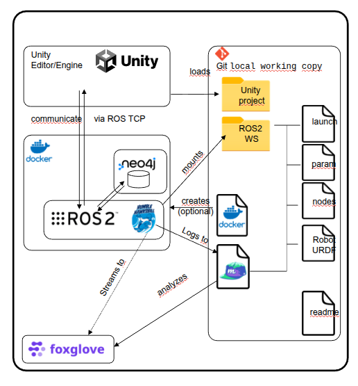
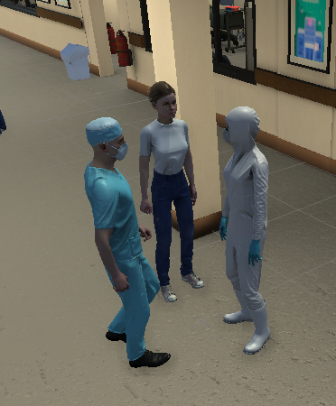
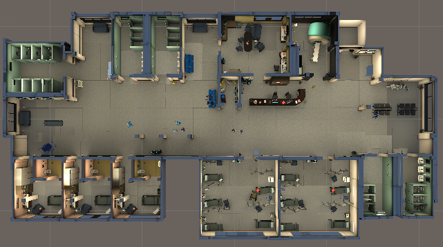
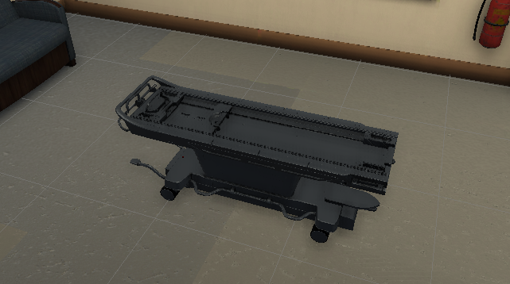

## Installation Guide

You can install this project in two ways: locally or using Docker.

* For Docker installation, refer to the Docker README.

* If you do not wish to use Docker, follow the steps outlined below.


**Note**: The first two steps are required for both installation methods
(UnityHub & Unity Editor installation, and the Floor Segmentation submodule).


#### [Install UnityHub and Unity Editor](UnityProject/README.md)
- Refer to the UnityHub and Unity Editor Installation Guide and follow the provided steps.
- Review the troubleshooting section for potential errors before proceeding with the installation.

#### Floor Segmentation submodule
- Before building the project work space, ensure you install the required submodule. Follow the steps below:

  ```bash
    cd autonomous-navigation-sim-Unity # Go to main project folder
    git submodule update --init --recursive
  ```

  - If prompted, create a **separate access token** for the submodule since it belongs to a different repository. Use the token to authenticate during the submodule update process.
  

   
#### [ROS2 Setup](https://docs.ros.org/en/humble/Installation.html)
   - Install **ROS2 Humble** on **Ubuntu 22.04** by following the official instructions.

#### [Neo4j](neo4j/README.MD)
- Neo4j is used as the database for this project.
- Refer to the Neo4j Installation Guide to download and install the appropriate version.


####  [ROS 2 Workspace Setup](ros2_ws/README.MD)
- Follow the instructions to set up the ROS 2 workspace.
- Install the three required external libraries/tools.
- Build the workspace and source the environment.
--------
## Project Description (Briefly)
Follow the steps below to understand the project workflow and open the project.



#### Unity based environment​

- Runs on every plattform​
- ROS2 Interface/Bridge​
- Human avatars can be added​
- Sensor-Models are available




#### Hospital environment ​

- Has been bought cheaply in asset store​
- Healthcare devices
- Human avatars (dynamic&Static)



#### Robot ​
- Has been included (obj-files & URDF) in Unity & ROS (Ackermann steering)​
- ROS2 humble is used​




#### Navigation​
- Nav2-Stack is used​
- Global map is created using segmentation, voronoi analysis​
- Local costmap is used as interface to planning​
- MPPI Follower is used
- Custom dynamic costmap layer for human avatars

#### Graph-DB​
- Neo4J and Memgraph have been analysed (both feasible, different +/-, Neo4J)​

### More Details about Sections
---

###  [Virtual Simulation Environment](readmes/virtual.md)
###  [Neo4j Database](readmes/database.md)
###  [Navigation](readmes/navigation.md)

# Project Story

### [Story Line](readmes/story.md)

Describe story line, testing scenario and use cases

### [Opening Project](readmes/open.md)
- Follow this guide to open the Unity project.

**Note:** The first time you open the Unity project, loading may take a significant amount of time
(depending on system performance) as Unity installs all required packages.
Subsequent launches will be much faster.

### [ROS-TCP Module Setup](readmes/tcpIP.md)
- The ROS-TCP module is already installed when you clone this repository. (Both in Unity and ROS WS)
- The only action required is to update the **IP address** to match your local host's IP address.

### [Running Simulator and Algorithms](readmes/run.md) 
- Go this link to see how to run Unity Project


### [Evaluation](readmes/test.md) 
- To systematically assess the performance of the system, a set of automated evaluation mechanisms and quantitative metrics are integrated into the framework.


#### My System Specifications:
- Processor: AMD® Ryzen 9 3900x 12-core processor × 24
- Graphics: NVIDIA Corporation TU102 [GeForce RTX 2080 Ti Rev. A]  - 12GB
- Memory: 32.0 GiB
- OS: Ubuntu 22.04.4 LTS 64-bit
- UnityHub 3.8.0
- Unity Editor 2020.3.11f1
