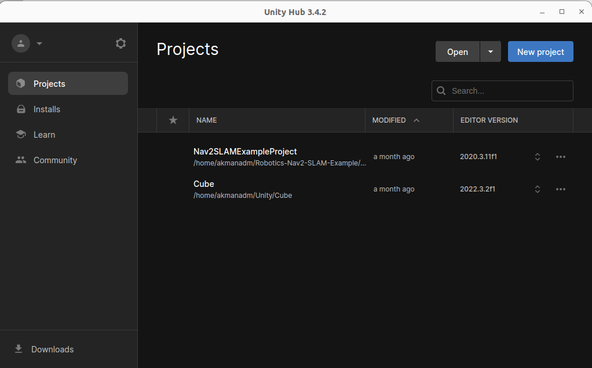
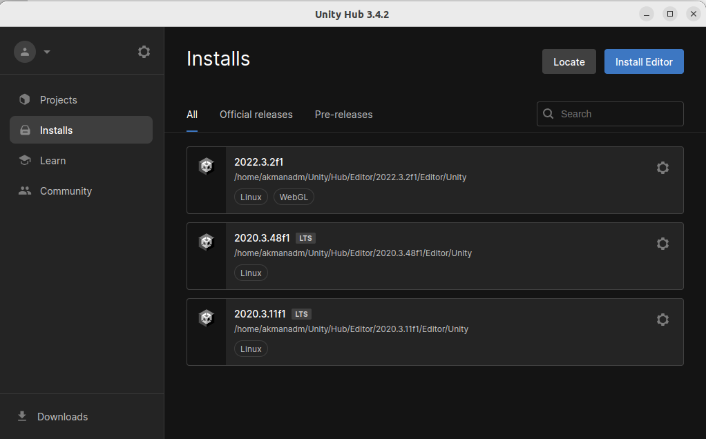
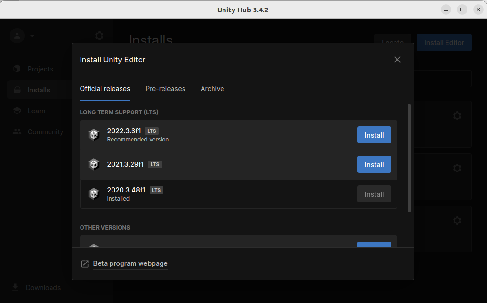

# Unity Project

This is a Unity project designed to demonstrate STEWARINA projects

## Project Structure

  
- **Assets/** - This is the main directory for all the assets used in the Unity project, including scripts, models, textures, and prefabs. [Go Assets](./Assets/) and [Go Scripts](./Assets/Scripts)
- **Library/** - Stores imported assets and other generated files required by Unity for faster loading and compilation. This folder is automatically generated and should generally not be included in version control.

- **Logs/** - Contains logs generated by Unity during project development and testing, which can be useful for debugging.

- **Packages/** - Contains package dependencies and metadata required by the Unity project. This folder keeps track of which Unity packages are used in the project.

- **ProjectSettings/** - Stores project-specific settings such as graphics, physics, input, and other configurations. These settings define how the project behaves and are essential for ensuring consistent behavior across different development environments.

- **Recordings/** - This folder may be used to store recording files, such as screen captures or in-game recordings, for testing or demonstration purposes.

- **UserSettings/** - Stores user-specific settings, typically containing information unique to each developer's environment, such as editor preferences.


## Project Files

- **Nav2SLAMExampleProject.sln** - Solution file for Visual Studio, aggregating all the `.csproj` files in the project for a cohesive development environment.

- **Unity.Robotics.Nav2Example.csproj** - Project file for the Unity Robotics package, potentially managing scripts and functionalities specific to ROS2 or robotics navigation in Unity.


## Install the Unity Hub  

if you are using Ubuntu 22, it is recommended to install UnityHub using the following steps.
* UnityHub == 3.4.2
* UnityEditor == 2020.3.11f

> * Alternatively, you may download the exact version we used from the release page [here](https://unity.com/releases/editor/qa/lts-releases). 
> * Note that if using a more recent version, you will receive some warnings to this effect when you first open the project, but you are fine to proceed through them.
---
### Installing Steps
- Add the repository

```
sudo sh -c 'echo "deb https://hub.unity3d.com/linux/repos/deb stable main" > /etc/apt/sources.list.d/unityhub.list'
```
- Get the key and update

```
wget -qO - https://hub.unity3d.com/linux/keys/public | sudo tee /etc/apt/trusted.gpg.d/myrepo.asc
```

```
sudo apt update
```


- Install UnityHub

```
sudo apt install unityhub=3.4.2
```
---

## Install the Unity Editor 

After the UnityHub installation is completed, the editor is installed. Download version `2020.3.11f`

- The main page. Click on **Installs**
  


- Click on **Install Editor**
  


- **Install** specified version of editor 




## Troubleshooting

### libdl.so Error
- First, if you are using Ubuntu 22, you will get a `libdl.so` error. Because this module is modified to `libdl.so.2` in Ubuntu 22. (If you are using Ubuntu 20, you do not need to do this step)
To solve this issue, run following commands:
    ```
    whereis libdl.so.2
    ```
- The output would be like this: `libdl.so: /usr/lib/x86_64-linux-gnu/libdl.so.2` (Copy your own!!)

- Then create symlink from `libdl.so.2` to `libdl.so`.

    ```
    sudo ln -s [PATH of libdl.so.2] [PATH of libdl.so]
    // Example command
    sudo ln -s /usr/lib/x86_64-linux-gnu/libdl.so.2 /usr/lib/x86_64-linux-gnu/libdl.so
    ```
### pink objetcs
If objects appear pink in your scene, it means the materials need updating. To fix this, update the Render Pipeline by following these steps:

* Go to the top menu bar and click Edit.
* Navigate to Render Pipeline (located at the bottom of the dropdown menu).
* Select Universal Render Pipeline > Upgrade Project Materials to UniversalRP Materials.
* Click the option to apply the update.

This will convert the materials to be compatible with the Universal Render Pipeline.

### libssl problem
If you are having a problem with this dependency, look following steps

_The reason for this error lies in incompatible versions of Open ssl on your machine and needed from Unity. Ubuntu 22.04 installs Open ssl 3.0 per default but Unity for Linux currently uses .Net5 per default and therefore can only run with Open ssl 1.0 or 1.1. To fix this, you need to downgrade your Open ssl on your machine to either 1.0 or 1.1._

Two possible options:

1. [Stackoverflow blog answer](https://stackoverflow.com/questions/72108697/when-i-open-unity-and-make-something-project-then-the-error-is-coming-that-no)
2. [askubuntu answer](https://askubuntu.com/questions/1000629/how-to-install-openssl-1-0-2-with-default-openssl-1-1-1-on-ubuntu-16-04/1094690#1094690)

---
## Learning More About Unity 
If you are brand new to Unity, found this example intersting, and want to learn more about how to use the Unity Editor, you may find these tutorials very useful for better familiarizing yourself with the Editor interface:
* [Exploring the Editor Layout](https://learn.unity.com/tutorial/exploring-the-editor-layout): a 10 minute tutorial giving a quick and straightforward overview of the Editor layout
* [Using the Unity Interface](https://learn.unity.com/tutorial/using-the-unity-interface): a 1 hr tutorial, which includes more context for each window and short introductions to commonly used components of the Scene

If you'd like more information about how to create customized environments, you may find some of these very in-depth tutorials on the creation of environments in Unity useful:

* [Foundations of Real-Time 3D](https://learn.unity.com/project/foundations-of-real-time-3d?uv=2019.4&missionId=5f777d9bedbc2a001f6f5ec7): A comprehensive look on the various aspects of building a realtime 3D environment in Unity. Although the whole course is 3 hours and 30 minutes, you may skip to the courses that are most relevant to your use case, which are likely to be [Work with GameObjects in a 3D Scene](https://learn.unity.com/tutorial/work-with-gameobjects-in-a-3d-scene?uv=2019.4&missionId=5f777d9bedbc2a001f6f5ec7&projectId=5fa1e431edbc2a001f53e6cc), [Add components to 3D GameObjects](https://learn.unity.com/tutorial/add-components-to-3d-gameobjects?uv=2019.4&missionId=5f777d9bedbc2a001f6f5ec7&projectId=5fa1e431edbc2a001f53e6cc), and [Get 3D assets](https://learn.unity.com/tutorial/get-3d-assets?uv=2019.4&missionId=5f777d9bedbc2a001f6f5ec7&projectId=5fa1e431edbc2a001f53e6cc)
* [Environments Live Session](https://learn.unity.com/tutorial/environments-march-31-2021#602326a4edbc2a4e1667c4c4): This Session provides a deeper dive into the intricacies of constructing a believable environment. While its focus is on environments for game development, most of the content is just as relevant to anyone interested in building realistic environments for simulation.

---


## Sources

[1] [Unity Releases](https://unity.com/releases/editor/qa/lts-releases)

[2] [Unity Hub](https://unity.com/unity-hub)

[3] [Unity Robotics Hub](https://github.com/Unity-Technologies/Unity-Robotics-Hub)

[4] [Dreamteck Splines Asset](https://assetstore.unity.com/packages/tools/utilities/dreamteck-splines-61926)

[5] [Hospital Env Asset](https://assetstore.unity.com/packages/3d/environments/hospital-rooms-standard-assets-215931)

[6] [Hospital Rooms Props](https://assetstore.unity.com/packages/3d/environments/hospital-room-props-74757)