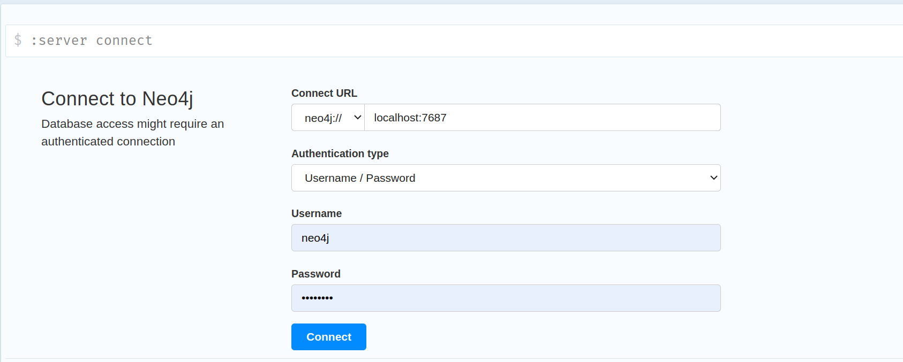
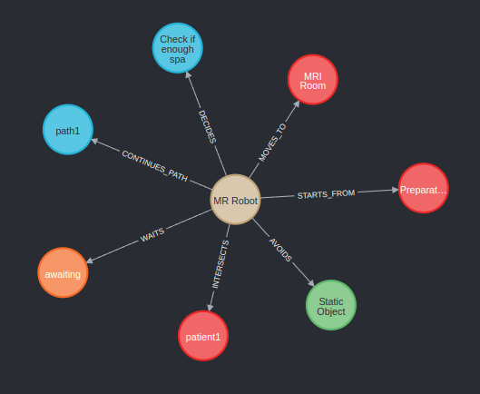

# Neo4j Project

This project is designed to work with a [Neo4j](https://neo4j.com/) database, focusing on importing scenarios, ontologies, and other data structures, as well as running various Cypher queries for data analysis. The project includes Python scripts for data import and management and a set of Cypher query files.

_Note: This directory is created solely for Neo4j testing purposes. The Neo4j project is located under the_ `ros2_ws` _directory._

## Folder Structure

- **codes/** - Contains Python scripts for importing data and managing the Neo4j database.
- **queries/** - Contains Cypher query files for various data analysis operations.
- **chart.drawio** - A diagram file created with [draw.io](https://www.draw.io/), possibly illustrating the database structure or relationships.

## Files in `codes/`

- **databaseupdate.py:** Script for updating the Neo4j database.

- **def_ontology_import_updated.py:** Script to import ontology data into the Neo4j database. This updated version may include enhancements or bug fixes.

- **import_ontology.py** - Script for importing ontology information into the Neo4j database.

- **neo4j.json** - A JSON configuration file  containing connection settings.

## Files in `queries/`

- **alternative.cypher:** Alternative Cypher query focusing on use cases.

- **alternativeusecases.cypher:** Cypher query focusing on alternative way to create use cases.

- **general.cypher:** General-purpose Cypher query, likely for common or broad database operations. Mostly for learning purposes.

- **humangrouping.cypher:**  Cypher query designed to group humans/obstacles according to their position and orientation.

- **robot.cypher** - Cypher query related to robot data.

- **RoomsConnectedNode.cypher** - Cypher query to find nodes that represent rooms connected in a certain way within the database.

- **usecases.cypher** - Cypher query file containing use case-related queries.


## Setting up the Environment

### Install Neo4j Database
Please follow below link to download Neo4j:

[How Install Neo4j Python Framework to Ubuntu](https://www.techrepublic.com/article/how-to-install-neo4j-ubuntu-server/)

### Install Python Framework

```bash
pip install neo4j
```
### Check Using System Service 
- Check neo4j status
```bash
systemctl status neo4j
```


### Set up username and password
#### 1. First Time Setup
- Start the Neo4j service:
    ```bash
    sudo systemctl enable --now neo4j
    ``` 
#### 2. Access the Browser Interface
- Open browser and go this link     `http://localhost:7474`. 
- Enter following password and user name:
    - **URL:** localhost:7687
    - **username:** neo4j
    - **password:** 12345678
- If you set it up this way, you will use the same user credentials as the project.


### Change username and password
####  1. Reset Password via Command Line 
- If you've forgotten the password, you can reset it:

    ```bash
    sudo systemctl disable --now neo4j
    ```
####  2. Remove the Password File
- Remove password file
    ```bash
    rm -rf /var/lib/neo4j/data/dbms/auth
    ```
#### 3. Restart neo4jw
- Restart neo4j service
    ```bash
    sudo systemctl enable --now neo4j
    ```
#### 4. Set a New Password
- Follow the first-time setup steps above to create a new password for the `neo4j` user.

-------------




### Sources

[1] [Neo4j](https://neo4j.com/)

[2] [Neo4j Tutorials](https://neo4j.com/docs/cypher-manual/current/introduction/)

[3] [draw.io](https://app.diagrams.net/)