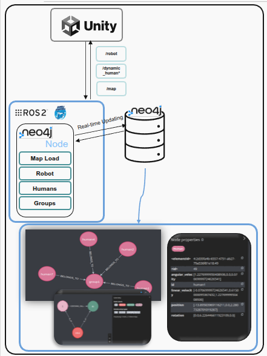

## Database​




**Neo4j** is used as a graph database to analyze complex spatial and social relationships.​

##### Data Flow:​

```

Unity ↔ ROS2 Bridge ↔ ROS2 Node with Neo4j Library↔ Neo4j
​
```

- Enables real-time data exchange between simulation and database​

- The Neo4j Python framework manages database updates, keeping Unity and ROS2 synchronized.​

- Supports runtime querying, group detection, and social interaction tracking.​

- It stores and continuously updates the following entities:​

  - 🗺️ Map Information: rooms, corridors, and static obstacles with spatial coordinates and relationships (e.g., Room–contains–Object).​

  - 🤖 Robot Data: ID, type, real-time positions, orientation, velocity.​

  - 🧍 Human Data: ID, role (doctor, nurse, patient), real-time position, orientation, velocity​

- Queries perform following;​

  - Human grouping based on position and orientation​

  - Room isolation​

  - Finding nearest cell to robot​

​

​
