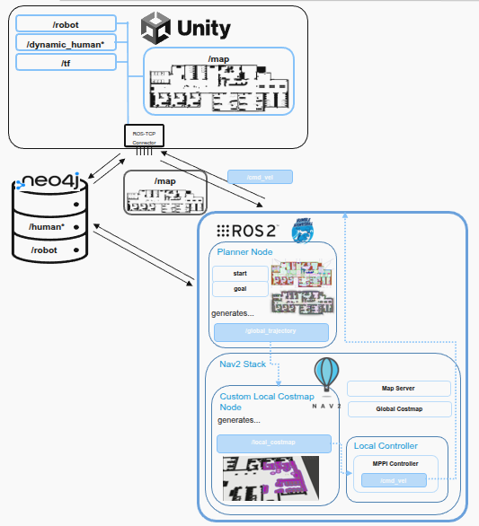
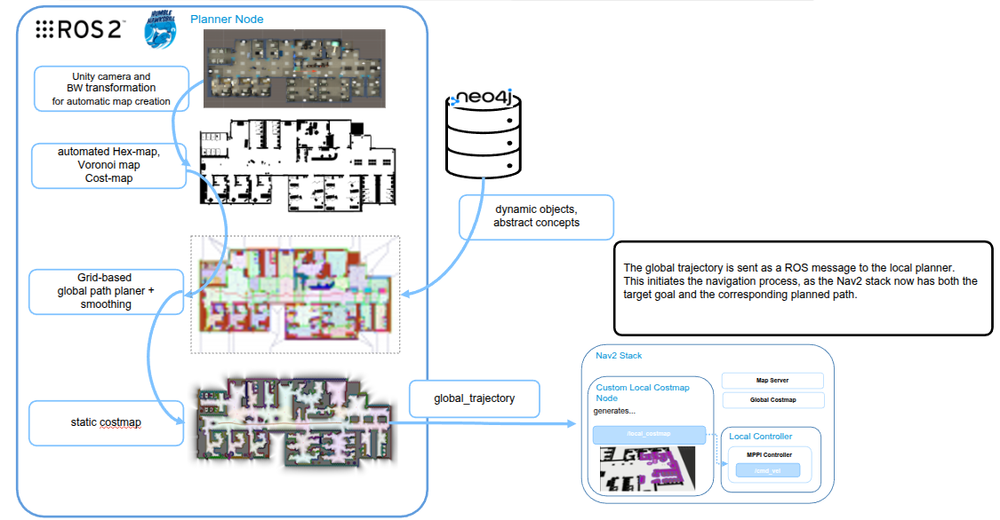

## Virtual Hospital​

We adopted the **Nav2** framework for navigation. This allowed us to experiment with multiple local planners and select the one that best fits our social navigation use cases.​

The **global trajectory generation** still follows our original approach. We use **Voronoi based** mapping, which builds a topological graph of safe corridors in the environment. Paths are then extracted along Voronoi cells, ensuring maximum clearance from obstacles and smooth navigation through narrow spaces.​

Instead of the previous **Social Force Model** (SFM) planner, we now use the **Model Predictive Path Integral** (MPPI) planner. The switch was made to improve performance, stability, and responsiveness in dynamic human environments.​

To integrate **MPPI** within the Nav2 stack, a local costmap is required. Since the robot has no onboard sensors, we implemented a custom local costmap using ground-truth data from Unity. ​

Because the **MPPI** planner directly produces /cmd_vel commands, the Stanley controller was removed from the navigation pipeline 

## Global Trajectory Planning

## NAV2 Stack 

