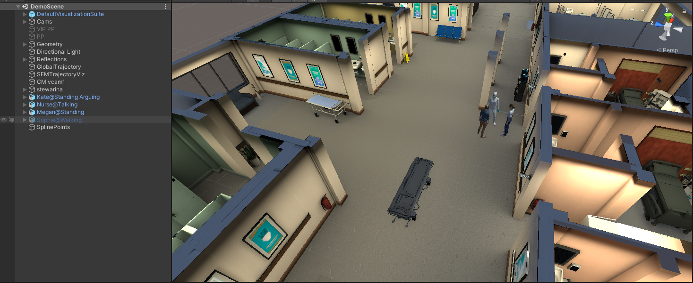
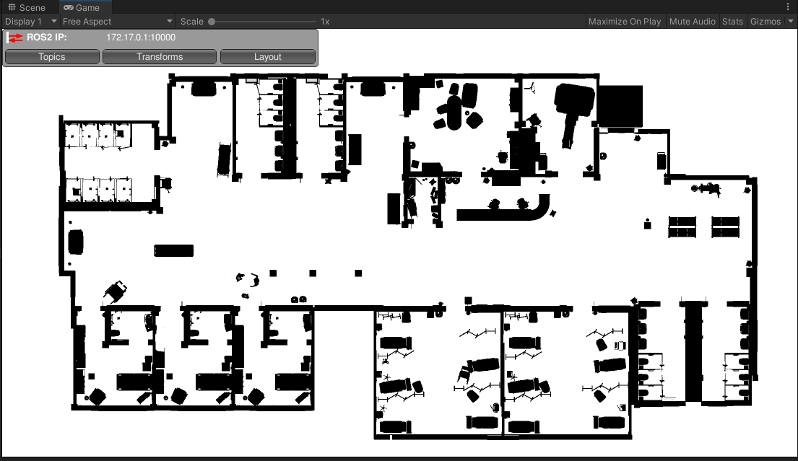
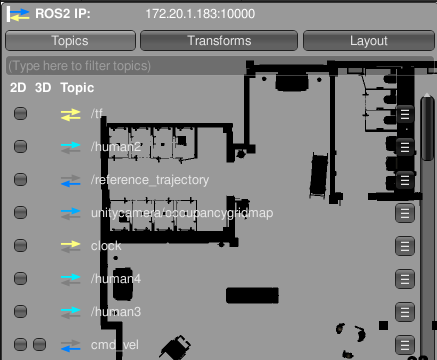

## How to Run Project

### Change IP Address in launch file
- Go **ros2_ws > project_main > launch > project_main_launch.py**. And change current IP with yours.
```python
# Launch tcp_endpoint_node immediately
        Node(
            package='ros_tcp_endpoint',
            executable='default_server_endpoint',
            name='tcp_endpoint_node',
            output='log',
            parameters=[{'ROS_IP': '172.20.1.180'}] # Change with your IP address
        ),
```

### Open Demo Scene
- Navigate to the `UseCaseScenes` folder within the `Assets` directory and select the `DemoScene` file.
- If the scene appears entirely pink, refer to the troubleshooting section in the [Unity ReadMe](../Nav2SLAMExampleProject/README.md) for guidance.


### Unity Scene


### Run The Game

- Click the **Play** button on the top bar to run the game.
- The game scene will automatically open.
- On the left, you can switch between different camera displays in the game:  
  - **Display 1:** Bird's-eye View  
  - **Display 2:** Robot's Follow Camera  
-  You can monitor the ROS-TCP communication in the HUD window. Currently, it appears red because the TCP communication has not been started yet.


### Run The Algorithm 

- Assume that, the ros2_ws has already built:
    ```bash
    source install/setup.bash
    ```
- Run launch file:
  ```bash
  ros2 launch project_main project_main_launch.py 
  ```

## Launch Arguments

| Argument        | Default Value | Description |
|-----------------|---------------|-------------|
| **`record_bag`** | `false` | Whether to record all topics into a ROS 2 bag (MCAP format). |
| **`test_name`** | `demo` | Name of the test/use case (used in bag output folder path). |
| **`map`** | `./src/costmap_plugin/map/map.yaml` | Full path to map YAML file. |
| **`params_file`** | `./src/costmap_plugin/nav2_with_human_layer.yaml` | Full path to Nav2 parameters YAML file. |
| **`use_sim_time`** | `true` | Use simulation clock (Unity/Gazebo) instead of system clock. |
| **`show_rviz`** | `true` | Whether to launch RViz2 automatically. |
| **`rviz_config`** | `<package_share>/project_main/rviz/project.rviz` | Full path to RViz2 configuration file. |

#### How to run with args:

```bash
ros2 launch project_main project_main_launch.py \
    record_bag:=true \
    test_name:=exp1 \
    map:=../ros2_ws/src/costmap_plugin/map/map.yaml \
    params_file:=../ros2_ws/src/costmap_plugin/nav2_with_human_layer.yaml\
    show_rviz:=false \
    use_sim_time:=true
```


- After that you can check ROS connection from same HUD. You can see which topics are publishing/subscribing via ROS-TCP module

  

- If you want to check only ROS connection, run following code:

  ```bash
  ros2 run ros_tcp_endpoint default_server_endpoint --ros-args -p ROS_IP:=172.20.1.183
  ```
  > Don't forget the change your local host IP