# Story Line

This test scenario is designed to evaluate the robot’s behavior in socially interactive and dynamic environments. It includes a sequence of encounters with individual humans, human groups, and static obstacles placed at different positions relative to the robot’s planned path. The scenario aims to assess the robot’s navigation performance, interaction awareness, and robustness while following a global path under varying environmental conditions.

## User Stories
<figure>
  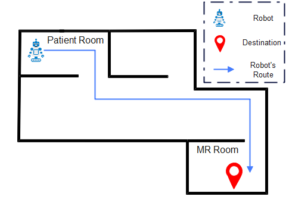
  <figcaption>Robot navigates in empty hallway</figcaption>
</figure>

<figure>
  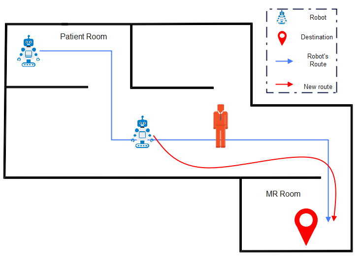
  <figcaption>Robot encounters with static human/obstacle</figcaption>
</figure>

<figure>
  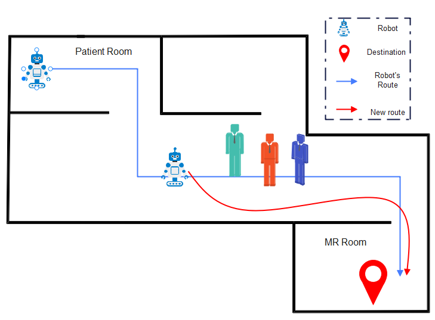
  <figcaption>Robot encounters with a group</figcaption>
</figure>

<figure>
  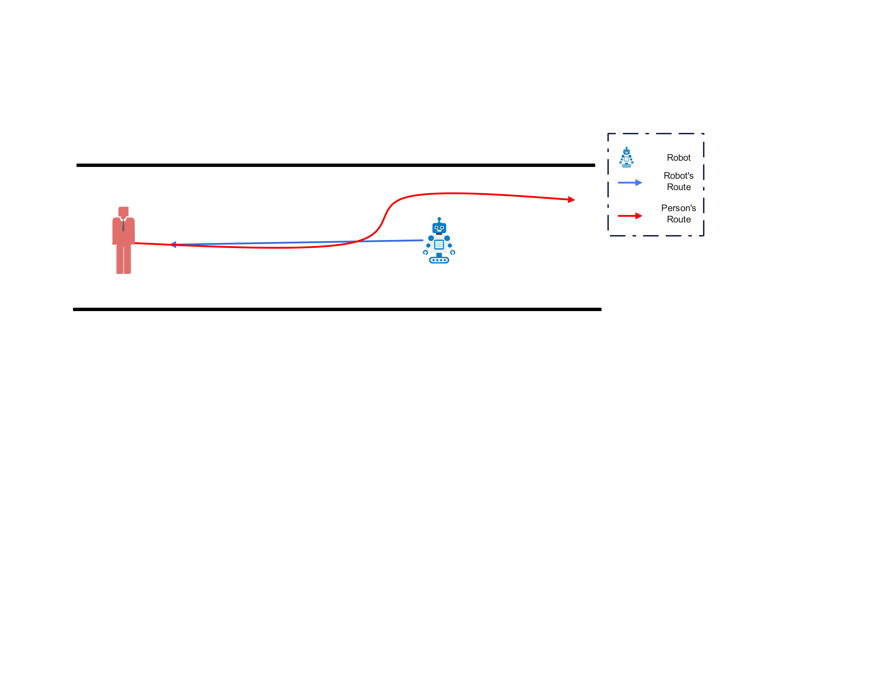
  <figcaption>Robot and human avatars walk through each other</figcaption>
</figure>

<figure>
  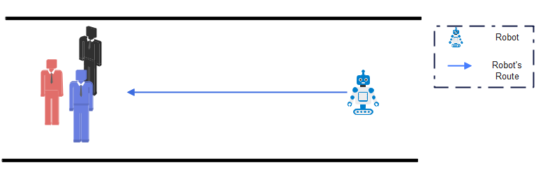
  <figcaption>Robot approaches to a group</figcaption>
</figure>

<figure>
  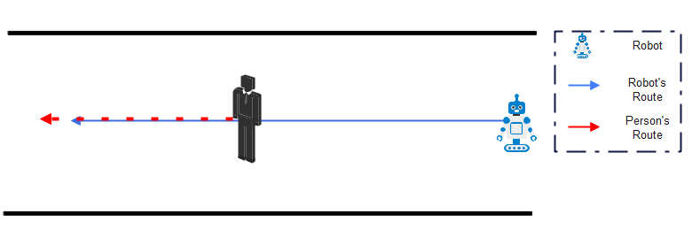
  <figcaption>Robot follows a human avatar</figcaption>
</figure>

## Story Line

1. The robot first encounters a human avatar approaching it. Both the robot and the human are moving relative to each other.

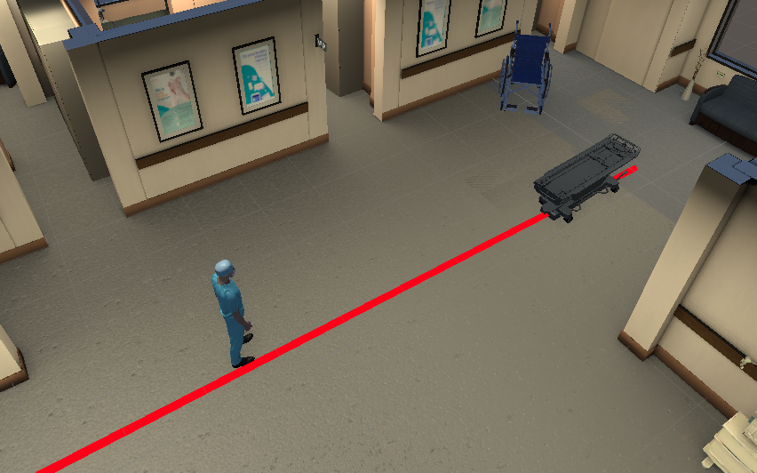
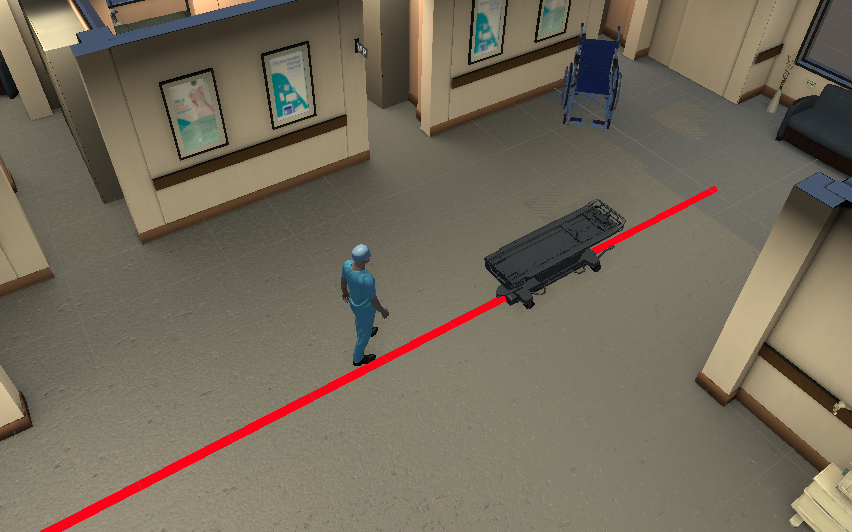

2. The robot then continues along a straight path without any obstacles.
   

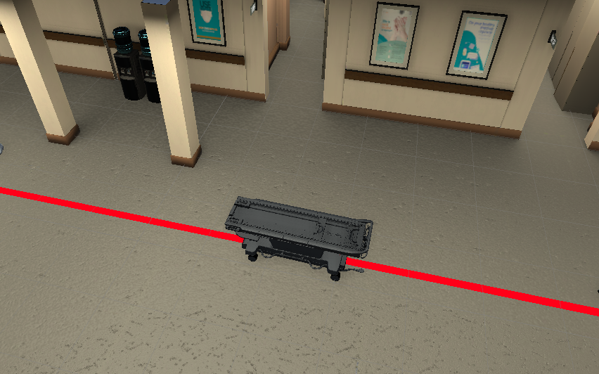

3. The robot encounters a group of humans.

4. One avatar dispatches from the group and starts moving in the same direction as the robot.
   
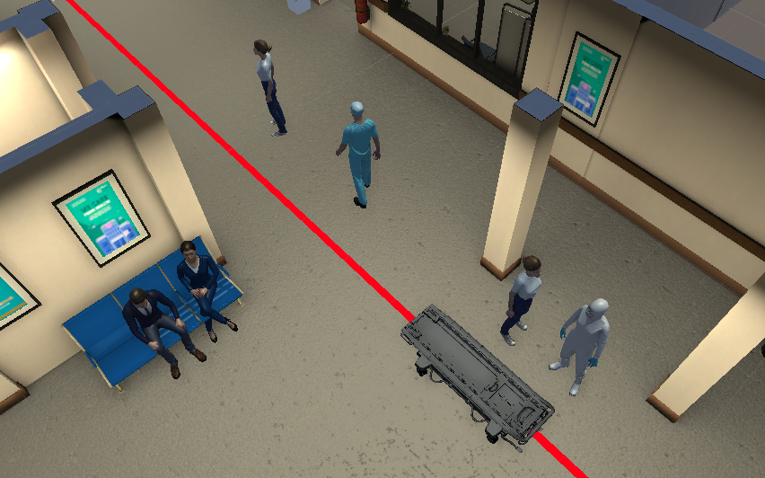

5. While continuing its motion, the robot encounters a static obstacle located close to its trajectory.

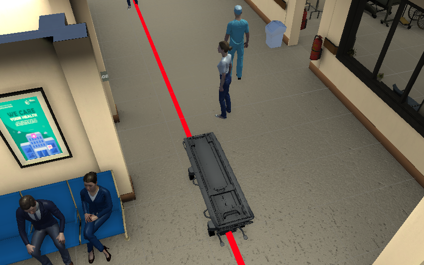

6. The robot encounters another static obstacle; this time, the obstacle is positioned directly on the global path.
   
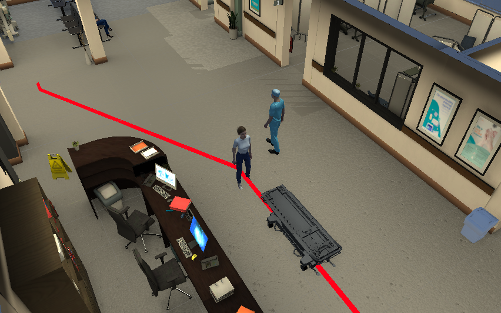
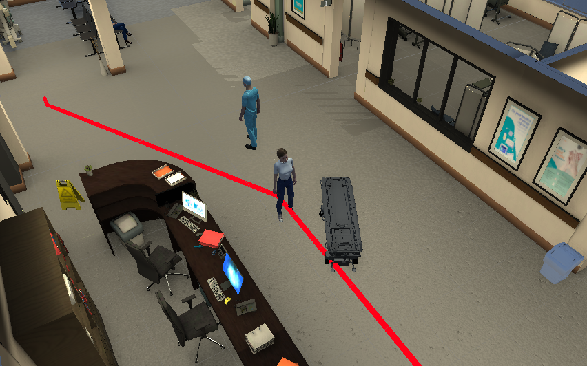

7. The robot passes the obstacle and follows human avatar again

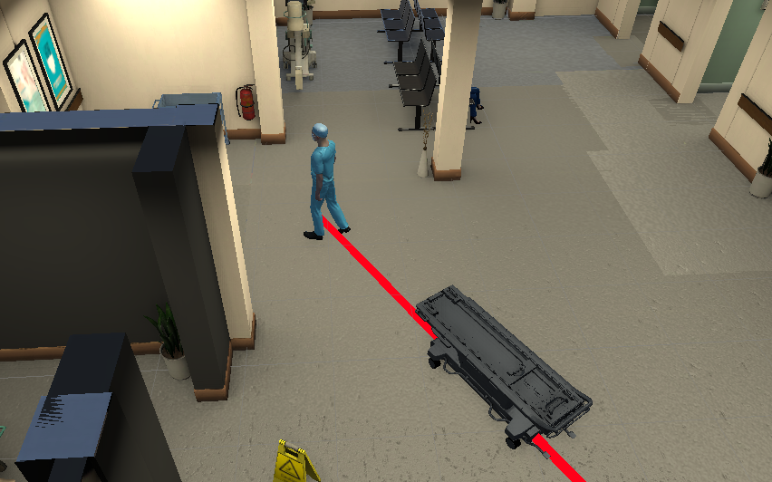

8. The robot finishes the track

