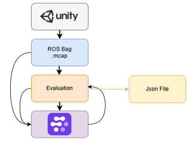
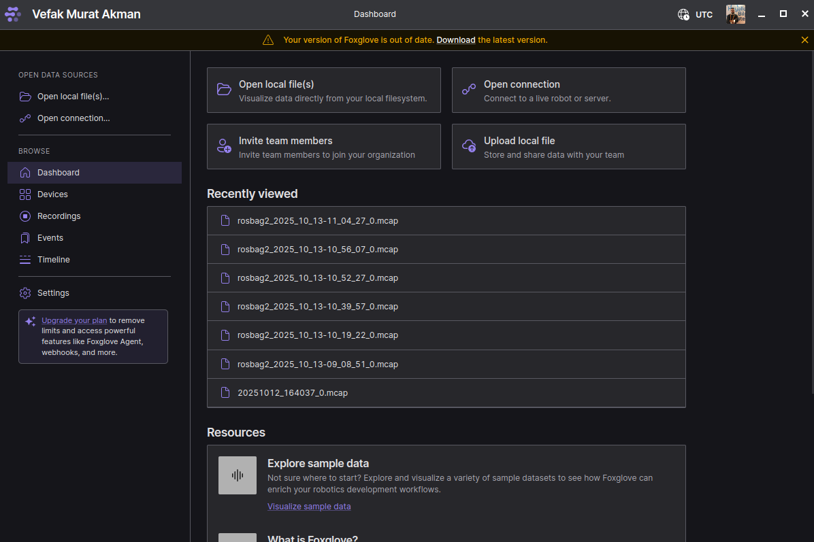
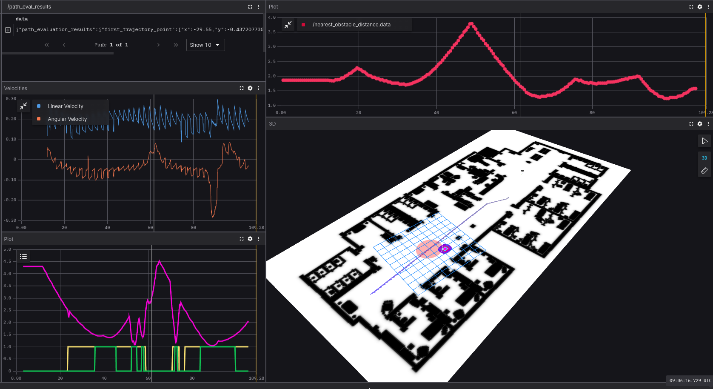

# Evaluation / Testing

To systematically assess the performance of the system, a set of automated evaluation mechanisms and quantitative metrics are integrated into the framework.

- Automatic ROS bag recording is triggered each time a launch file is executed, ensuring reproducible and traceable experiments.

- A clean and well-structured directory layout is enforced, using consistent and descriptive naming conventions for experiments and outputs.

- The launch file exposes configurable arguments, enabling flexible testing, parameter sweeps, and automated evaluation pipelines.




### Evaluation Metrics

The following metrics are used to evaluate navigation performance, safety, and social compliance:

- Completion Time (CT): Total time required for the robot to reach the goal.

- Path Length (PL): Total distance traveled by the robot.

- Distance Error (DE): Deviation from the reference or planned trajectory.

- Orientation Error (OE): Difference between the robot’s orientation and the desired orientation along the path.

- Success Rate (SR): Ratio of successfully completed runs to total runs.

- Minimum Distance to Obstacles (MDO): Closest distance maintained from static or dynamic obstacles.

- Personal Space Violation: Measurement of intrusions into human personal space during navigation.

### ros launch Arguments

The main launch file provides several arguments to customize evaluation scenarios and experimental setups:


| Argument      | Default Value                                   | Description                                                     |
|---------------|--------------------------------------------------|-----------------------------------------------------------------|
| record_bag    | false                                            | Whether to record all topics into a ROS 2 bag (MCAP format).   |
| test_name     | demo                                             | Name of the test/use case (used in bag output folder path).    |
| map           | ./src/costmap_plugin/map/map.yaml                | Full path to map YAML file.                                    |
| params_file   | ./src/costmap_plugin/nav2_with_human_layer.yaml | Full path to Nav2 parameters YAML file.                        |
| use_sim_time  | true                                             | Use simulation clock (Unity/Gazebo) instead of system clock.  |
| show_rviz     | true                                             | Whether to launch RViz2 automatically.                         |
| rviz_config   | <package_share>/project_main/rviz/project.rviz | Full path to RViz2 configuration file.                         |


## Evaluation Workflow

The evaluation process is designed as a two-stage pipeline consisting of data recording and offline analysis, ensuring reproducibility and modularity.

### Scenario Execution and Data Recording

The evaluation scenario is first launched using:

```
ros2 launch project_main project_main.py show_rviz:=true test_name:=exp1 record_bag:=true
```

During execution, **ROS2** **bag** recording is automatically enabled by passing the appropriate launch arguments (see the table above).
All relevant topics are recorded in **MCAP** format, which provides efficient storage and compatibility with modern visualization and analysis tools. (FoxGlove)

Each experiment is stored in a dedicated **folder named** according to the selected test configuration, allowing structured experiment management and repeatable testing.

### Offline Evaluation Using Recorded Bags

Once the scenario execution is completed, the recorded bag file (e.g., exp1.mcap) is replayed for offline evaluation:

```
ros2 bag play exp1.mcap
```

The evaluation is performed using three separate ROS 2 nodes, each responsible for a specific subset of metrics:

- **Minimum Distance to Obstacles (MDO)**

```
ros2 run evaluations mdo_calculator
```


This node computes the minimum distance between the robot and static or dynamic obstacles over the entire trajectory.

- **Personal Space Evaluation**

```
ros2 run evaluations personal
```


This node evaluates personal space intrusions by measuring the robot’s proximity to nearby humans during navigation.
- **General Navigation Metrics**

```
ros2 run evaluations
```


This node computes the remaining evaluation metrics, including completion time, path length, distance error, orientation error, and success rate.

>**Note:**
The MDO and personal space metrics are implemented as separate nodes due to their higher computational and logical complexity.
Separating them improves code readability, maintainability, and modularity, resulting in a cleaner and more extensible evaluation framework.

### Unified Evaluation Launch File

For convenience and automation, all evaluation steps can also be executed using a single launch file:

``` 
ros2 launch evaluations eval.py
```


This launch file:

* Replays the recorded ROS 2 bag file,

* Executes all evaluation nodes simultaneously,

* Records **a new ROS 2 bag** file containing the evaluation results and computed metrics.

This approach enables batch processing of experiments and simplifies large-scale evaluations.

### Visualization and Analysis

- After all metrics have been computed, Foxglove Studio can be used to visualize both the original data and the evaluation results.
- Users can interactively inspect trajectories, distances, personal space violations, and other metrics using custom plots and 3D visualizations with FoxGlove
- This modular evaluation pipeline allows flexible experimentation, repeatable benchmarking, and intuitive result inspection.



