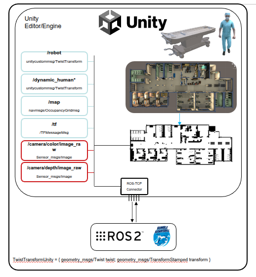
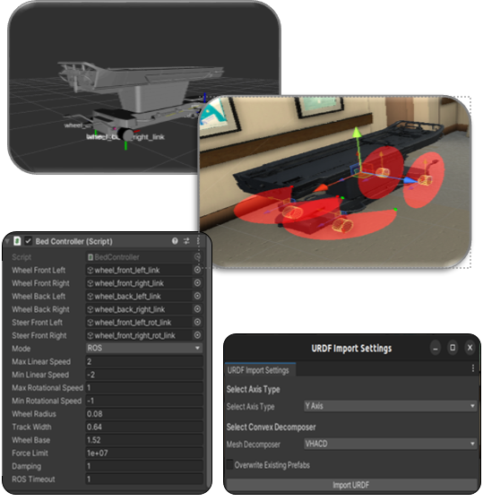
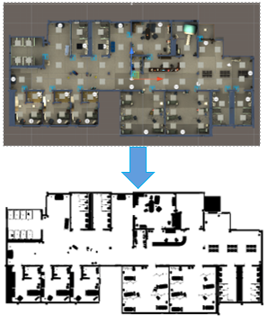
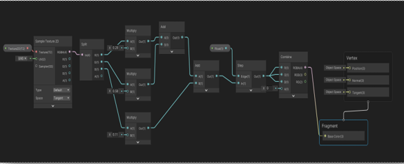

## Virtual Hospital​

#### Unity Simulation​

- Runs hospital & robot scenes in real time​
- Human avatars + robot physics + sensors​
- ROS 2 bridge via ROS TCP Connector​
- Real-time feedback loop Unity ↔ ROS 2​
- Map Generation​
- Hospital Environment​

#### Published Topics​

- **/robot** → Pose + Twist (TwistTransformUnity)​

- **/dynamic_human** → All human transforms + velocities​

- **/map** → 2D Map data​

- **/camera/color** & **/camera/depth** → RGB-D data​

- **/tf**, **/tf_static** → Frame tree (map → odom → robot*)​

#### Robot URDF

- After the **URDF** model of the hospital bed was created, it was imported into Unity for simulation.​

- The model includes:​

  - 2 front wheels​

  - 2 rear wheels​

  - 2 front rotational wheels (for steering)​

-The **base_footprint** frame is positioned at the center of the rear axle, ensuring proper reference alignment with ROS 2. (Ackermann Model)
​

#### Map Generation

- Visual shader creation with Shader Graph (GPU-optimized) boosted FPS 8 → 30​
- URP: Unity’s efficient cross-platform rendering system​
- Blit Material Feature added to URP Forward Renderer for camera-based binary conversion​
- Normal shaders don’t support URP → Shader Graphs used instead​
- Custom URP created so only the camera output is affected, not the entire scene

