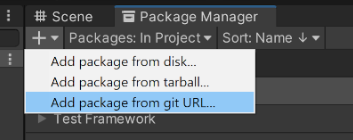
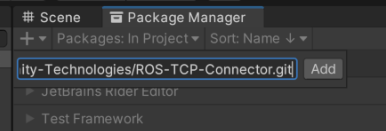

# ROS TCP Endpoint
# ROS Unity Integration
## ROS TCP Connector Setup 

Setup ROS TCP Connector via Docker or on local workspace.

These instructions cover the setup for only ROS2. 

- Get GitHub Repo.

    ```
    git clone https://github.com/Unity-Technologies/Unity-Robotics-Hub.git
    ```

This module can be installed in two ways; docker image or local ROS2 workspace.

1. (Docker) For building Docker image, navigate to **tutorials/ros_unity_integration** in copy of this repo and run the following commands:
    ```
    docker build -t foxy -f ros2_docker/Dockerfile .
    docker run -it --rm -p 10000:10000 foxy /bin/bash
    ```
2. (Local workspace) Alternatively, if you won't use the Docker image, download the ROS2 branch of the [ROS-TCP-Endpoint](https://github.com/Unity-Technologies/ROS-TCP-Endpoint) repository and copy it into the **src** folder in your colcon workspace. Switch the branch to **main-ros2**.
   
    *For this step, ROS2 must be installed in your local.*

   ```
   git checkout main-ros2
   ```

    Then navigate to your colcon workspace and run the following commands:
    ```
    source install/setup.bash
    colcon build
    source install/setup.bash
    ```
3. Navigate to colcon workspace and run command below
   
    - To get your IP address: `hostname –I`
   
   (Local workspace) The following command starts communication between ROS and Unity. It **must** stay running while using Unity.
	```
    ros2 run ros_tcp_endpoint default_server_endpoint --ros-args -p ROS_IP:=<your IP address>
    ```

    (Docker) If you're running ROS in a Docker container, 0.0.0.0 is a valid incoming address, so you can run as:
    ```
    ros2 run ros_tcp_endpoint default_server_endpoint --ros-args -p ROS_IP:=0.0.0.0
    ```


    Once the **server_endpoint** has started, it will print something similar: 
    ```
    [INFO] [1603488341.950794]: Starting server on 192.168.50.149:10000
    ```
---
## Unity TCP Connector Setup
- Launch Unity and create a new project. The robotics package works best with a version of Unity no older than 2020.

    

- Open Package Manager and click the **+** button at the top left corner. Select **add package from git URL** and enter 
  `https://github.com/Unity-Technologies/ROS-TCP-Connector.git?path=/com.unity.robotics.ros-tcp-connector` to install TCP Connector

  

- If you're not using a Docker container, open **Robotics/ROS Settings** from the Unity menu bar, and set the **ROS IP Address** variable to the IP you set earlier. If you're using Docker, leave it as the default 127.0.0.1.
  
  
  
- Change **ROS1** to **ROS2**
  
  
---
## .srv and .msg Setup
The instructions so far have set up the ROS-TCP-Connector package for general use. If you are specifically following one of the ROS–Unity Integration tutorials, you'll need to do the following additional steps:

- Copy the **unity_robotics_demo** and **unity_robotics_demo_msgs** packages into the **src** folder in your colcon workspace. (Skip this step if you're using the Docker)
  
  - Copy them from `tutorials/ros_unity_integration/ros2_packages` in this repo.

- Build new packages
  ```
  colcon build
  source install/setup.bash
  ```
    In the Unity menu bar, go to **Robotics > Generate ROS Messages**. In **Message Browse Window**, click **Browse** at the top right to set ROS message path to `tutorials/ros_unity_integration/ros_packages/unity_robotics_demo_msg`.

    Expand **unity_robotics_demo_msgs** and click **Build 2 msgs** and **Build 2 srvs** to generate C# scripts from the ROS *.msg* and *.srv* files.

    

### Now you are ready to implement [tutorials](https://github.com/Unity-Technologies/Unity-Robotics-Hub/blob/main/tutorials/ros_unity_integration/README.md#tutorials)