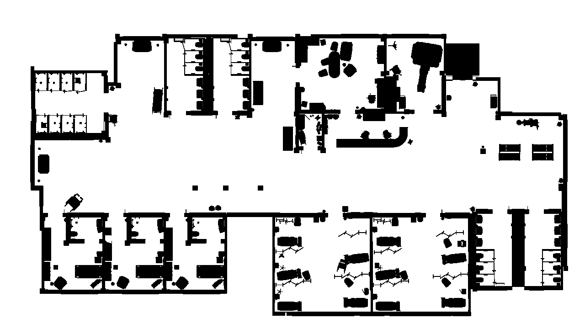

## image_subscriber

This ROS2 node, `ImageSubscriberNode`, subscribes to an image topic (e.g., `/unitycamera/occupancygridmap`) and processes incoming images. It converts the ROS Image messages into OpenCV images for display and optional saving. Key features include:

* **Image Conversion:** Using `CvBridge`, the node converts ROS `Image` messages into an OpenCV-compatible format.
* **Image Display:** Each received image is displayed in a window labeled `Map`.
* **Save Functionality:** By pressing `s` on the keyboard, the displayed image is saved in a `saved_images` directory with a timestamp-based filename.
* **Shutdown Command:** Pressing `q` closes all OpenCV windows and shuts down the ROS2 node.
  
