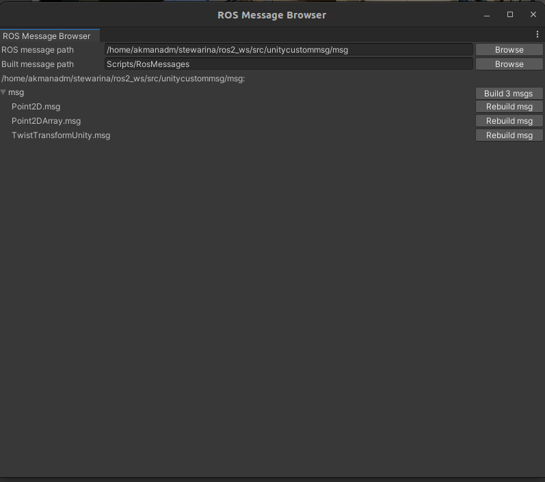

## unitycustommsg

This package, `unitycustommsg`, defines custom ROS2 message types for interacting with Unity and supporting custom data structures in a ROS2 environment. The custom messages in this package are structured to facilitate communication between ROS2 nodes and Unity-based applications, especially in scenarios involving trajectory points and transformation data.

### Package Structure
* **msg:** Contains custom message definitions.

  * Point2D.msg: Represents a 2D point with `x` and `y` coordinates.
  * Point2DArray.msg: An array of `Point2D` messages, useful for sending a sequence of points (e.g., a path or trajectory).
  * TwistTransformUnity.msg: Combines a `Twist `message with a `TransformStamped` message to convey both position/orientation and velocity in one message.


### Custom Messages
**Point2D.msg**
```bash
float64 x
float64 y
```
**Point2DArray.msg**

This message is ideal for sending a list of waypoints or a trajectory for the robot to follow.

```bash
Point2D[] points
```

**TwistTransformUnity.msg**

This message format is particularly useful for sending the robot's pose and velocity in a single message, enabling more efficient communication in applications that require both data.

Combines both velocity and transformation data:

```bash 
geometry_msgs/Twist twist
geometry_msgs/TransformStamped transform
```
* _twist:_ Contains linear and angular velocity information.
* _transform:_ Contains position and orientation data.

### Dependencies
Ensure that the following dependencies are added in package.xml:

* `geometry_msgs` (for Twist and TransformStamped)
### Installation
1. Clone the package into your ROS2 workspace.
2. Build the package:
```bash
colcon build --packages-select unitycustommsg
```
3. Source the workspace:
```bash
source install/setup.bash
```
### Notes
Update `CMakeLists.txt` and `package.xml` whenever new messages are added.
Make sure to rebuild the package after modifying any `.msg` files.

## How to add custom .msg & .srv to Unity

> Note: If you download the project, the messages will already be loaded.

After building the custom messages, verify them as follows:
```bash
ros2 interface show unitycustommsg/msg/
    unitycustommsg/msg/Point2D
    unitycustommsg/msg/Point2DArray
    unitycustommsg/msg/TwistTransformUnity
```

1. In the Unity menu bar, go to Robotics -> Generate ROS Messages.... In the Message Browser window, click the Browse button at the top right to set the ROS message path to `../ros2_ws/src/unitycustommsg/msg`.
2. Set `Built message path` as `Scripts/RosMessages`. Otherwise, Scripts can't import these messages
3. In the message browser, expand the custommsg/msg subfolder and click "Build 2 msgs" and "Build 2 srvs" to generate C# scripts from the ROS .msg and .srv files. (In our case, only .msg files)
4. After making these changes, you need to rebuild both the `ROS-TCP-Endpoint` and `unitycustommsg packages`. This will ensure that ROS-TCP-Endpoint can recognize and use the custom messages.
```bash
colcon build --packages-select ros_tcp_endpoint unitycustommsg 
```

